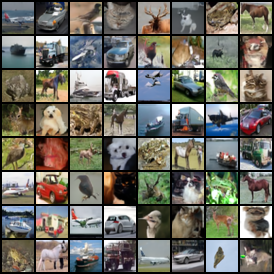

# Flow Matching (Euler) - Experiment Notes

## Goal
Quickly identify why generated images looked poor and decide which Euler setup to keep for comparison against DDPM/DDIM.

## Runs tested

### Run 1 - Baseline
- Standard Euler flow-matching training.
- Result: images not convincing, not enough evidence to isolate the bottleneck.

### Run 2 - Longer training (no EMA)
- Same setup as Run 1, more epochs (100).
- Purpose: test whether undertraining was the main issue.

### Run 3 - EMA enabled
- Same as Run 2, but with EMA (`decay ~0.999`) and EMA weights for sampling.
- Purpose: test weight stabilization effect at generation time.

## Locked A/B evaluation (final, comparable)
- Same eval protocol for both runs:
  - same script family
  - same NFEs: `10, 20, 50, 100`
  - same number of generated images: `5000`
  - explicit checkpoints

### Final table

| NFE | FID Run2 (no EMA) | FID Run3 (EMA) | Delta (EMA - Run2) | sec/img Run2 | sec/img Run3 | Delta sec/img |
|---:|---:|---:|---:|---:|---:|---:|
| 10  | 155.552872 | 158.977325 | +3.424454 | 0.003656 | 0.003632 | -0.000025 |
| 20  | 157.015427 | 159.907486 | +2.892059 | 0.006364 | 0.006363 | -0.000001 |
| 50  | 156.509140 | 154.382004 | -2.127136 | 0.014594 | 0.014592 | -0.000002 |
| 100 | 157.733276 | 152.857712 | -4.875565 | 0.028315 | 0.028320 | ~0.000000 |

## Takeaway
- EMA is worse at very low NFE (10/20), but better at higher NFE (50/100).
- Runtime is effectively the same.
- For quality-focused comparisons (typical report setting at NFE 50/100), keep **Run 3 (EMA)** as Euler baseline.

## Decision for project
- Use **Run 3 (EMA)** for Euler vs DDPM vs DDIM comparison.
- Mention low-NFE behavior separately (Run 2 slightly better at 10/20).

---

## Update (2026-03-13) - Conditional Flow Matching (CIFAR-10)

### Main result
- Conditional training dramatically improves quality versus the previous non-conditional Euler runs.
- Best overall checkpoint in the current logs:
  - **Epoch 190, NFE 100**
  - **FID = 13.186687** (`fid_std = 0.018418` across 3 seeds)
  - **IS = 8.271859**
  - **sec/img = 0.025744**

### Best checkpoint by NFE

| NFE | Best epoch | Best FID | FID std | IS mean | sec/img |
|---:|---:|---:|---:|---:|---:|
| 10  | 190 | 21.069645 | 0.009113 | 7.813992 | 0.003371 |
| 20  | 200 | 16.691305 | 0.007554 | 7.953713 | 0.005854 |
| 50  | 180 | 13.781469 | 0.011525 | 8.076406 | 0.013311 |
| 100 | 190 | 13.186687 | 0.018418 | 8.271859 | 0.025744 |

### Comparison with previous baselines
- Previous best Euler (non-conditional, Run 3 EMA): **FID = 152.857712** at NFE 100.
- DDPM baseline in this repo snapshot: **FID = 85.431396** at NFE 100.
- New conditional run is therefore a major quality jump in this setup.

### What changed vs `flow-matching-euler-cifar10` (parameters)

| Parameter | `flow-matching-euler-cifar10` | `flow-matching-euler-cifar10-conditional` | Change impact |
|---|---:|---:|---|
| `epochs` | 100 | 500 (run continued to ~210 in current logs) | Much longer optimization |
| `run_prefix` | `cfm_cifar10` | `cfm_cifar10_conditional` | Separate run lineage |
| `num_classes` | — | 10 | Class conditioning enabled |
| `class_dropout_p` | — | 0.1 | Enables classifier-free guidance training |
| `base_ch` | implicit/default | 128 | Explicit model capacity setting |
| `t_dim` | implicit/default | 256 | Explicit time/embedding size |
| `use_attn_16` | not exposed | `True` | Extra attention at 16x16 |
| `use_attn_8` | not exposed | `True` | Extra attention at 8x8 |
| `progress_cfg_scale` | — | 1.5 | Guided visual sampling during training |
| `eval_num_images` | 5000 | 10000 (per seed) | Lower metric variance |
| `eval_seed(s)` | single `2026` | `(2026, 2027, 2028)` | Multi-seed evaluation |
| `eval_cfg_scale` | — | 1.0 | CFG path available at eval |

Notes:
- Core training hyperparameters are otherwise aligned (`dataset_name=cifar10`, `image_size=32`, `batch_size=128`, `lr=2e-4`, `weight_decay=1e-5`, `use_ema=True`, `ema_decay=0.999`, same `eval_nfes`).
- The biggest effective differences are **conditioning + CFG-ready training + longer training horizon + stronger evaluation protocol**.

### Which epoch visual to print?
- **Best qualitative candidate (primary): Epoch 190, NFE 100** (best overall FID).
- **Speed/quality trade-off candidate (secondary): Epoch 180, NFE 50** (very close FID, ~2x faster sampling).
- Suggested report figure: show both side-by-side to justify the final checkpoint choice.

