# Flow Matching for Image Generation

**Conditional Flow Matching vs. Diffusion Models: A Systematic Comparison on CIFAR-10**

> Implementation of Optimal-Transport Conditional Flow Matching (OT-CFM) from scratch, benchmarked against DDPM and DDIM on CIFAR-10, with a focus on the trade-off between sampling speed (NFE) and generation quality (FID).

<p align="center">
  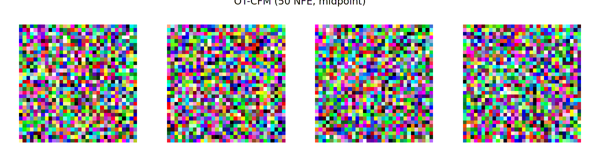
  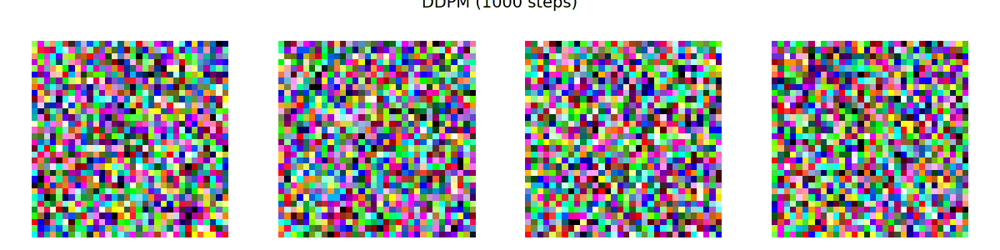
</p>
<p align="center">
  <em>Left: OT-CFM (50 NFE, midpoint) — Right: DDPM (1000 steps)</em>
</p>

---

## Highlights

<p align="center">
  
</p>
<p align="center"><em>Flow matching on toy 2D data: noise particles transported to target distributions via learned velocity fields</em></p>

<p align="center">
  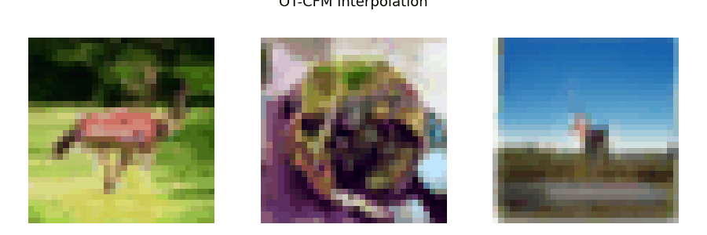
  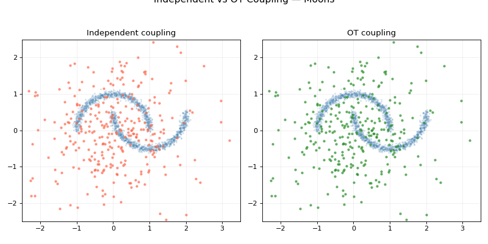
</p>
<p align="center">
  <em>Left: Latent space interpolation (slerp) — Right: Independent vs OT coupling comparison</em>
</p>

---

## Overview

Flow Matching is a generative modeling framework that learns a continuous velocity field `v_theta(x, t)` to transport samples from noise (t=0) to data (t=1) along straight-line paths. Compared to diffusion models, which follow curved stochastic trajectories, the optimal-transport formulation in CFM defines direct interpolations:

```
x_t = (1 - t) * x_0 + t * x_1,    velocity target: u = x_1 - x_0
```

where `x_0 ~ N(0, I)` is Gaussian noise and `x_1` is a data sample. At inference, images are generated by solving the ODE `dx/dt = v_theta(x, t)` from t=0 to t=1 using standard numerical solvers (Euler, Midpoint, RK4). The straight-path formulation requires significantly fewer integration steps than diffusion models for comparable quality.

---

## Key Results

All models were trained on CIFAR-10 (32x32) and evaluated on 10,000 generated images. FID and IS are computed against the training set.

### Best Results per Model

| Model | Best FID | NFE | Solver | ms/img |
|-------|------:|----:|--------|-------:|
| DDPM | 13.06 | 1000 | ddpm | 205.0 |
| DDIM | 17.96 | 50 | ddim | 10.5 |
| **Unconditional OT-CFM** | **10.65** | 100 | rk4 | 20.7 |
| Class-Conditional CFM | 12.19 | 100 | rk4 | 24.3 |

### Full Comparison Table

| Method | Solver | NFE | FID | IS (mean) |
|--------|--------|----:|------:|----------:|
| DDPM | ddpm | 1000 | 13.06 | 8.18 |
| DDIM | ddim | 10 | 22.18 | 7.77 |
| DDIM | ddim | 50 | 17.96 | 7.84 |
| DDIM | ddim | 100 | 18.43 | 7.88 |
| Unconditional OT-CFM | midpoint | 10 | 18.25 | 8.07 |
| Unconditional OT-CFM | midpoint | 50 | 12.02 | 8.44 |
| Unconditional OT-CFM | rk4 | 100 | **10.65** | 8.58 |
| Class-Conditional CFM | euler | 100 | 13.19 | 8.27 |
| Class-Conditional CFM | midpoint | 100 | 12.64 | 8.36 |
| Class-Conditional CFM | rk4 | 100 | 12.19 | 8.46 |

**Key findings:**
- OT-CFM matches DDPM's 1000-step quality (FID=13.06) in just **~50 steps** — a **20x speedup**
- DDIM saturates around NFE=50 and cannot match CFM quality at any step count
- Midpoint solver offers the best quality-per-NFE ratio; RK4 wins at high NFE (100+)

See [RESULTS.md](RESULTS.md) for full analysis.

---

## Visualizations

### Generation Trajectories

Watch noise evolve into images in real-time across all three methods:

| DDPM (1000 steps) | DDIM (50 steps) | OT-CFM (50 NFE) |
|:--:|:--:|:--:|
|  | 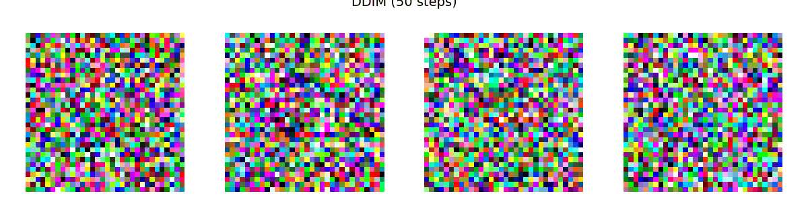 |  |

### Latent Space Interpolation

Spherical linear interpolation (slerp) between noise vectors — smooth transitions indicate a well-structured latent space:

| OT-CFM | DDIM |
|:--:|:--:|
| 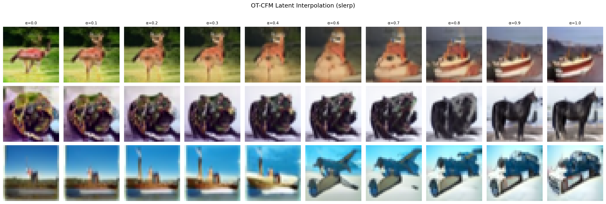 | 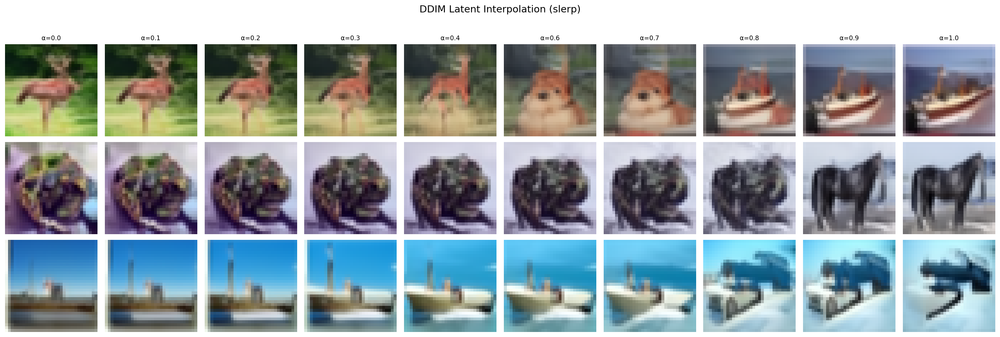 |

### 2D Vector Fields on Toy Data

Learned velocity fields transporting Gaussian noise into target distributions (moons, circles, spirals):

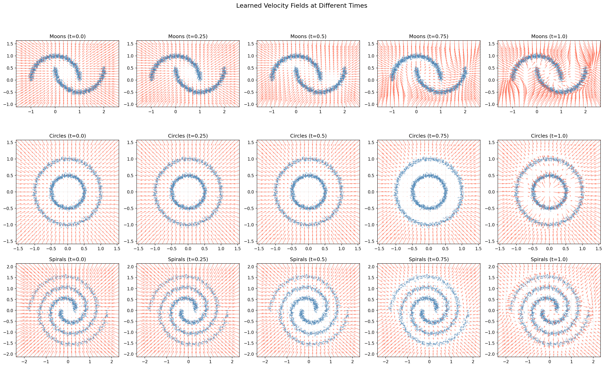

| Real vs Generated | Animated Trajectories |
|:--:|:--:|
| 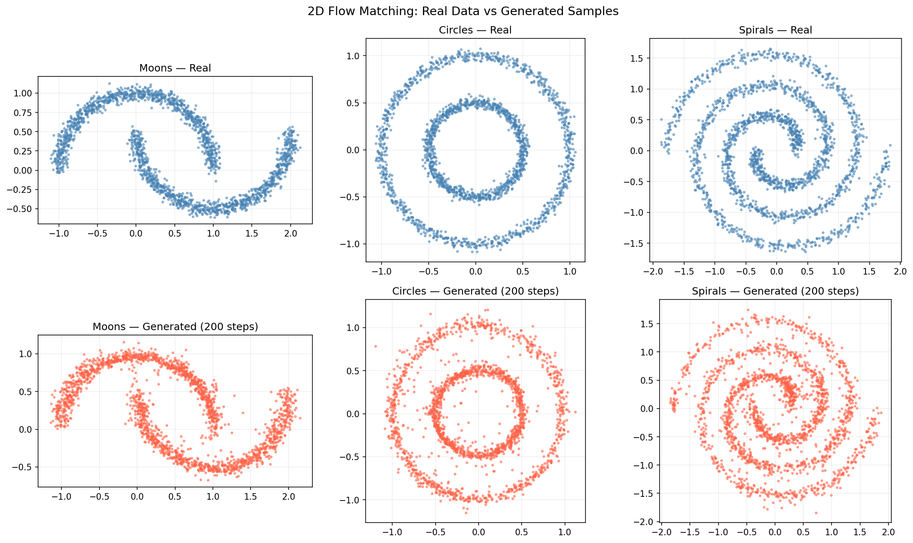 |  |

### Independent vs OT Coupling

Comparing random pairing (independent coupling) vs optimal-transport pairing (minibatch OT). OT coupling produces straighter marginal trajectories with less path crossing:

| Static Snapshots | Animated |
|:--:|:--:|
| 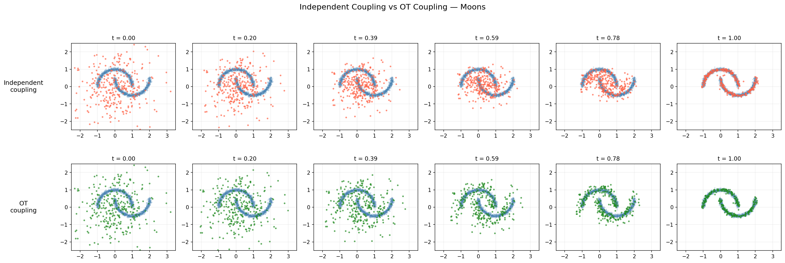 |  |

### Class-Conditional Generation

Per-class samples from the class-conditional CFM model, and the effect of classifier-free guidance (CFG):

| No guidance (cfg=1.0) | With guidance (cfg=2.0) |
|:--:|:--:|
| 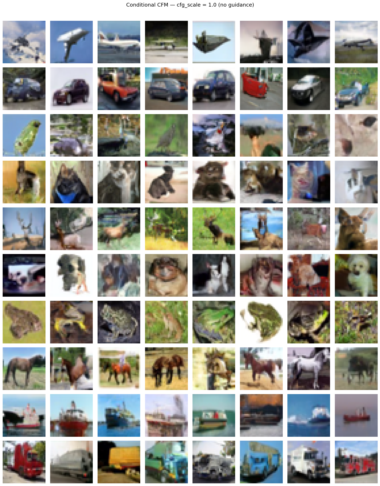 | 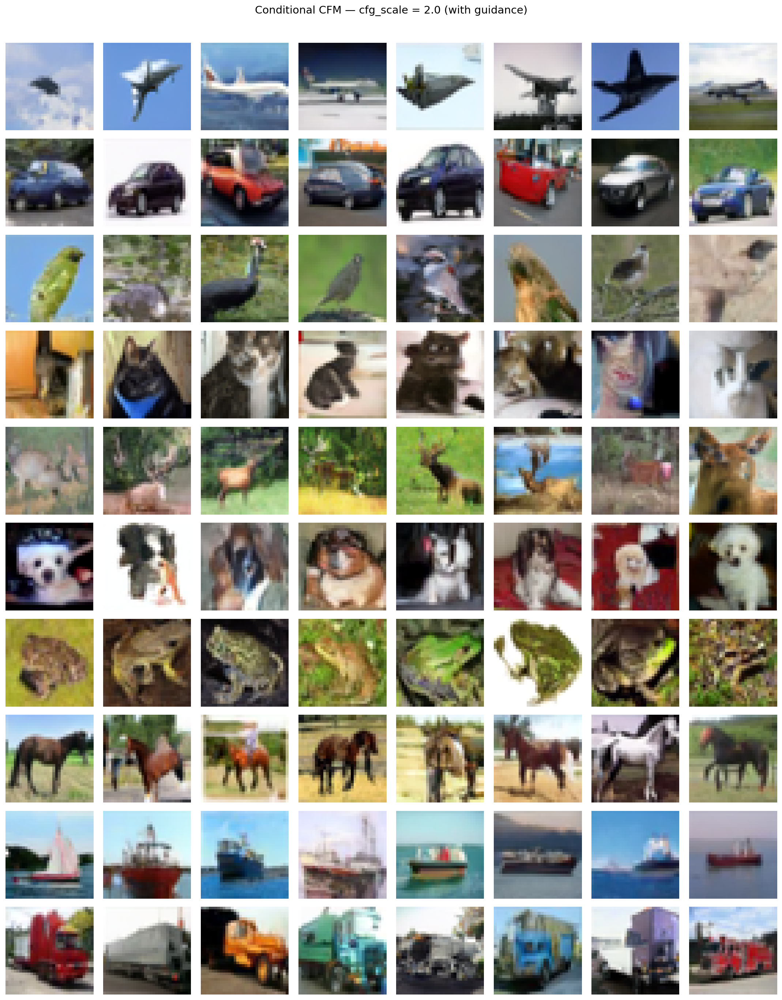 |

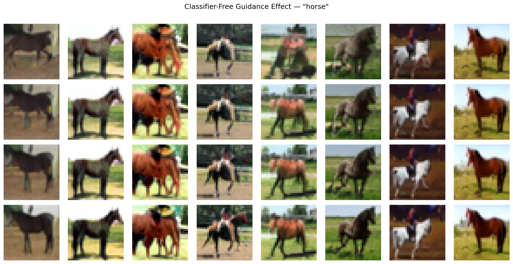

---

## Models

| Model | Architecture | Conditioning | Epochs | Solver(s) |
|-------|-------------|-------------|--------|-----------|
| DDPM/DDIM | UNet (128 base, [1,2,2,2], 4 heads, GN32) | None | 500 | DDPM (1000 steps), DDIM (variable) |
| Unconditional OT-CFM | Same UNet as DDPM | None | 500 | Midpoint, RK4 (torchdiffeq) |
| Class-Conditional CFM | SimpleFlowUNet (128 base, [1,2,4], GN8, class emb) | 10 classes + CFG | 210 | Euler, Midpoint, RK4 |

All models use EMA (Exponential Moving Average) weights for evaluation.

---

## Project Structure

```
.
├── notebooks/
│   ├── ddpm/
│   │   ├── 01_ddpm.ipynb              # DDPM/DDIM training
│   │   └── 02_evaluate.ipynb          # DDPM/DDIM evaluation (FID, IS, runtime)
│   ├── cfm/
│   │   ├── 01_cfm.ipynb               # Unconditional OT-CFM training
│   │   ├── 02_evaluate.ipynb          # OT-CFM evaluation
│   │   └── 03_evaluate_cond.ipynb     # Class-conditional CFM evaluation
│   ├── 04_visualizations.ipynb        # All visualizations (trajectories, interpolations, etc.)
│   └── colab_setup.ipynb              # Colab environment setup
├── results/
│   ├── ddpm/                          # DDPM/DDIM metrics, samples, checkpoints
│   ├── cfm/                           # OT-CFM metrics, samples, checkpoints
│   └── cfm_elora/                     # Class-conditional CFM metrics
├── visualizations/                    # All generated figures and GIFs
├── docs/                              # Reference papers
├── RESULTS.md                         # Detailed results analysis
└── ARCHITECTURE.md                    # Evaluation protocol documentation
```

## Methods

### 1. Conditional Flow Matching (CFM)
- Trains a velocity field `v_theta(x_t, t)` via MSE regression on the target velocity `(x_1 - x_0)`
- Generates samples by integrating the learned ODE from t=0 to t=1
- Supports Euler, Midpoint, and RK4 solvers with variable step counts

### 2. DDPM (Baseline)
- Denoising Diffusion Probabilistic Model with 1000-step Markov chain
- Standard training with epsilon-prediction objective and cosine noise schedule

### 3. DDIM (Baseline)
- Deterministic sampling from the pretrained DDPM model
- Allows skipping steps (10, 20, 50, 100) without retraining

The unconditional OT-CFM and DDPM/DDIM share the **same UNet backbone** for fair comparison. The class-conditional CFM uses a slightly different architecture with class embeddings and classifier-free guidance.

---

## Getting Started

All training and evaluation runs on **Google Colab** with GPU (T4/A100).

1. Open `notebooks/colab_setup.ipynb` to configure GitHub auth and Drive checkpointing
2. Train models using the respective notebooks in `notebooks/ddpm/` and `notebooks/cfm/`
3. Evaluate with the evaluation notebooks
4. Generate all visualizations with `notebooks/04_visualizations.ipynb`

### Requirements

- Python >= 3.9
- PyTorch >= 2.0
- torchvision
- torchdiffeq
- scipy
- matplotlib
- torchmetrics (for FID/IS computation)

## References

1. Lipman, Y., Chen, R.T.Q., Ben-Hamu, H., Nickel, M. *Flow Matching for Generative Modeling.* ICLR, 2023.
2. Tong, A., Malkin, N., Huguet, G., Zhang, Y., et al. *Improving and Generalizing Flow-Based Generative Models with Minibatch Optimal Transport.* TMLR, 2024.
3. Ho, J., Jain, A., Abbeel, P. *Denoising Diffusion Probabilistic Models.* NeurIPS, 2020.
4. Song, J., Meng, C., Ermon, S. *Denoising Diffusion Implicit Models.* ICLR, 2021.
5. Liu, X., Gong, C., Liu, Q. *Flow Straight and Fast: Learning to Generate and Transfer Data with Rectified Flow.* ICLR, 2023.
